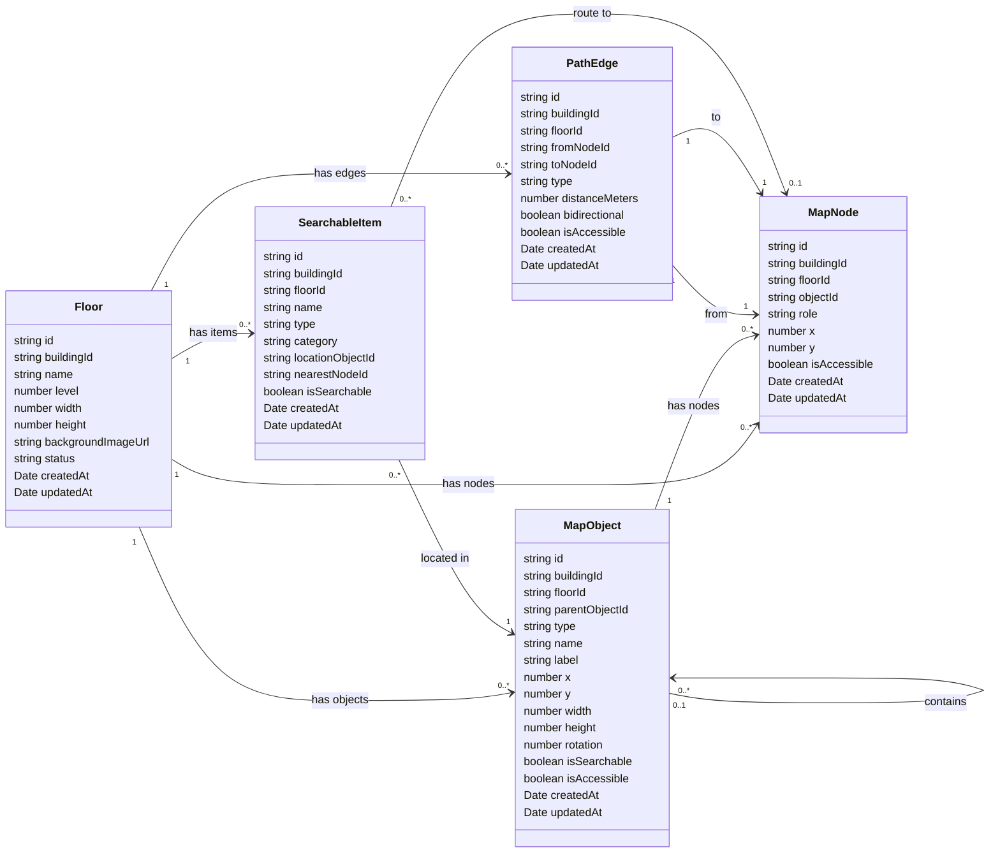

```mermaid
classDiagram
direction LR

class Floor {
  string id
  string buildingId
  string name
  number level
  number width
  number height
  string backgroundImageUrl
  string status
  Date createdAt
  Date updatedAt
}

class MapObject {
  string id
  string buildingId
  string floorId
  string parentObjectId
  string type
  string name
  string label
  number x
  number y
  number width
  number height
  number rotation
  boolean isSearchable
  boolean isAccessible
  Date createdAt
  Date updatedAt
}

class MapNode {
  string id
  string buildingId
  string floorId
  string objectId
  string role
  number x
  number y
  boolean isAccessible
  Date createdAt
  Date updatedAt
}

class PathEdge {
  string id
  string buildingId
  string floorId
  string fromNodeId
  string toNodeId
  string type
  number distanceMeters
  boolean bidirectional
  boolean isAccessible
  Date createdAt
  Date updatedAt
}

class SearchableItem {
  string id
  string buildingId
  string floorId
  string name
  string type
  string category
  string locationObjectId
  string nearestNodeId
  boolean isSearchable
  Date createdAt
  Date updatedAt
}

Floor "1" --> "0..*" MapObject : has objects
Floor "1" --> "0..*" MapNode : has nodes
Floor "1" --> "0..*" PathEdge : has edges
Floor "1" --> "0..*" SearchableItem : has items

MapObject "0..1" --> "0..*" MapObject : contains
MapObject "1" --> "0..*" MapNode : has nodes

PathEdge "1" --> "1" MapNode : from
PathEdge "1" --> "1" MapNode : to

SearchableItem "0..*" --> "1" MapObject : located in
SearchableItem "0..*" --> "0..1" MapNode : route to
```
