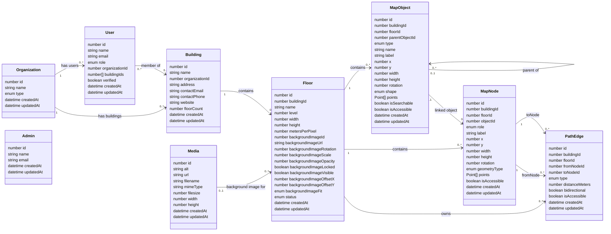

# Current Database Schema

This document reflects the application collections currently registered in
`src/collections/index.ts` and stored through Payload CMS using the configured
SQLite or MongoDB adapter.



## Registered collections

| Payload slug | Purpose |
| --- | --- |
| `admins` | Payload Admin accounts — the platform team. Separate from organization accounts and unrelated to any organization. |
| `users` | Organization accounts, application roles, organization membership, and building membership |
| `organizations` | Organization name and organization type |
| `buildings` | Buildings belonging to an organization — name, contact/address metadata, and a cached floor count |
| `media` | Uploaded files, including floor reference images |
| `floors` | Floor dimensions, scale, status, and background-image settings |
| `map-objects` | Rooms, walls, doors, hallways, connectors, and other visible map geometry |
| `map-nodes` | Walkable points used to construct the navigation graph |
| `path-edges` | Weighted connections between navigation nodes |

`SearchableItems` is not a registered collection. Searchability is currently
stored directly on each map object using `isSearchable`, and searchable map
objects are used as destinations in the viewer.

## Field values

### Organization

`type` can be:

```text
hospital | university | mall | office | airport | library | other
```

One organization can have many `users` and many `buildings`.

### Building

`organization` is a required relationship — every building belongs to
exactly one organization, and an organization can have many buildings.

`floorCount` is a denormalized cache of how many floors belong to the
building, kept in sync by an `afterChange`/`afterDelete` hook on `Floors`
(`src/collections/map/Floors.ts`) — it exists so dashboards can read a
building summary without a separate floor-count query. It is not an
authoritative source; it is always derived from `floors.building`.

`address`, `contactEmail`, `contactPhone`, and `website` are optional
metadata fields for the building's location and contact info.

### User

`role` can be:

```text
owner | manager | member
```

- **owner** — the organization's creator (assigned automatically on signup).
  There is one owner per organization. An owner implicitly has access to
  every building in their organization — no explicit `buildings` membership
  is needed or stored for them.
- **manager** — has elevated permissions (can create/update/delete floors,
  map objects, map nodes, and path edges) on the buildings listed in their
  `buildings` field.
- **member** — read-only access to the buildings listed in their `buildings`
  field. Cannot create, update, or delete map data.

Payload adds authentication fields to the user collection, including email,
password hashes, verification data, password-reset data, login-attempt data,
and sessions. Sensitive authentication fields are managed by Payload and are
not ordinary editor fields.

The `organization` relationship is required — every user belongs to exactly
one organization (one email = one user = one organization). One organization
can have many users.

The `buildings` relationship (`hasMany`) is the many-to-many membership
between users and buildings. It only applies to `manager`/`member` roles; the
admin UI hides it for `owner` since ownership already implies full org-wide
building access.

### Admin

The separate `admins` authentication collection is the only collection allowed
to sign in to Payload Admin. Admin accounts represent the platform team, are
not organization users, are not linked to any organization, and do not use
the application user role field. The `owner`/`manager`/`member` roles on a
`users` record are application-level roles only and do not grant access to
Payload Admin.

### Floor

`status` can be:

```text
draft | published
```

`backgroundImageFit` can be:

```text
fill | cover | contain
```

The floor stores its coordinate-space size in `width` and `height`.
`metersPerPixel` converts map-coordinate distance into real-world metres.

A floor can reference an uploaded `media` record through `backgroundImage`.
`backgroundImageUrl` remains available as a text-based image source. Rotation,
scale, opacity, visibility, lock state, offsets, and fit are stored alongside
the floor.

`building` is a required relationship to the `buildings` collection. Every
floor belongs to exactly one building; a building can have many floors.
`map-objects`, `map-nodes`, and `path-edges` each carry their own `building`
relationship too (rather than only deriving it through their `floor`), so
building-scoped access control can filter each of those collections directly.

### Map object

`type` can be:

```text
room | wall | door | hallway | stairs | elevator | escalator | washroom |
exit | poi | aisle | shelf | section
```

`shape` can be:

```text
rectangle | ellipse | polygon
```

Position and geometry are stored using `x`, `y`, `width`, `height`, `rotation`,
and optional `points`. Every point contains numeric `x` and `y` values. Payload
also assigns an optional internal ID to array entries.

`parentObject` is an optional self-relationship used to place one map object
inside another. `isSearchable` controls whether an object can appear as a map
destination, while `isAccessible` records its accessibility state.

### Map node

`role` can be:

```text
entrance | exit | hallway_point | stairs_entry | elevator_entry |
escalator_entry | shelf_access
```

`geometryType` can be:

```text
rectangle | polygon | line | icon
```

A node belongs to one floor and may optionally reference a map object. Its
geometry is stored through `x`, `y`, optional size and rotation fields, and an
optional points array.

### Path edge

`type` can be:

```text
walkway | stairs | elevator | escalator | ramp
```

Every edge belongs to a floor and requires both a `fromNode` and a `toNode`.
`distanceMeters` is the weight used by shortest-path navigation.
`bidirectional` controls whether the graph can traverse the edge in both
directions, and `isAccessible` controls whether it is allowed in accessible-only
routes.

Cross-floor stairs, elevators, escalators, and ramps still use path-edge
records. The edge is stored under its origin floor and can point to a node on a
different floor.

## Access control

`src/collections/access/index.ts` defines the reusable access functions:

- `isPlatformAdmin` / `isPlatformAdminOrSelf` — true only for the `admins`
  auth collection (the platform team). Used to gate `admins`, `organizations`,
  and the non-self paths of `users`.
- `accessibleBuildingIds(req)` — resolves the set of building IDs a `users`
  account can act on: every building in their organization for `owner`, or
  their own `buildings` relationship for `manager`/`member`. Platform admins
  bypass this entirely.
- `buildingRead` / `buildingManage` — read/write access for the `buildings`
  collection itself. Reading is scoped to accessible buildings for any role;
  creating/updating/deleting a building is restricted to the `owner` of its
  organization.
- `buildingContentRead` / `buildingContentWrite` — read/write access for
  `floors`, `map-objects`, `map-nodes`, and `path-edges`, scoped by their own
  `building` field. Write access excludes `member` (read-only role).

## How the records rebuild a map

```text
Building groups an organization's floors
                 |
                 v
Floor dimensions and image settings
                 |
                 v
      Map objects draw the visible floor
                 |
                 v
       Map nodes create graph vertices
                 |
                 v
   Path edges connect and weight the vertices
                 |
                 v
 Searchable objects become route destinations
```

The database stores structured values rather than a screenshot. Loading the
building, floor, objects, nodes, and edges gives the editor and viewer enough
information to redraw the map and rebuild its navigation graph.

## Payload-managed collections

Payload also creates internal collections and tables for features such as
key-value storage, locked documents, preferences, and migrations. They are
framework infrastructure, not part of Wayfinder's application-level map
schema, so they are not included in the diagram above.
