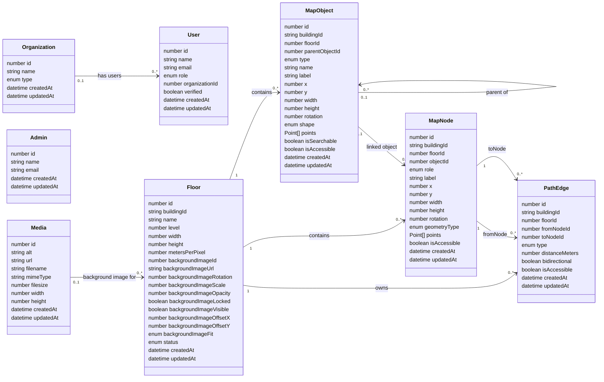

# Current Database Schema

This document reflects the application collections currently registered in
`src/collections/index.ts` and stored through Payload CMS using the configured
SQLite or MongoDB adapter.



## Registered collections

| Payload slug | Purpose |
| --- | --- |
| `admins` | Payload Admin accounts, separate from organization users |
| `users` | Organization accounts, application roles, and organization membership |
| `organizations` | Organization name and organization type |
| `media` | Uploaded files, including floor reference images |
| `floors` | Floor dimensions, scale, status, and background-image settings |
| `map-objects` | Rooms, walls, doors, hallways, connectors, and other visible map geometry |
| `map-nodes` | Walkable points used to construct the navigation graph |
| `path-edges` | Weighted connections between navigation nodes |

`SearchableItems` is not a registered collection. Searchability is currently
stored directly on each map object using `isSearchable`, and searchable map
objects are used as destinations in the viewer.

## Field values

### Organization

`type` can be:

```text
hospital | university | mall | office | airport | library | other
```

### User

`role` can be:

```text
admin | user
```

Payload adds authentication fields to the user collection, including email,
password hashes, verification data, password-reset data, login-attempt data,
and sessions. Sensitive authentication fields are managed by Payload and are
not ordinary editor fields.

The `organization` relationship is optional. One organization can be linked to
many users.

### Admin

The separate `admins` authentication collection is the only collection allowed
to sign in to Payload Admin. Admin accounts are not organization users and do
not use the application user role field. The `admin` role on a `users` record is
an application role only and does not grant access to Payload Admin.

### Floor

`status` can be:

```text
draft | published
```

`backgroundImageFit` can be:

```text
fill | cover | contain
```

The floor stores its coordinate-space size in `width` and `height`.
`metersPerPixel` converts map-coordinate distance into real-world metres.

A floor can reference an uploaded `media` record through `backgroundImage`.
`backgroundImageUrl` remains available as a text-based image source. Rotation,
scale, opacity, visibility, lock state, offsets, and fit are stored alongside
the floor.

There is currently no separate Building collection. `buildingId` is stored as
required text on floors, map objects, map nodes, and path edges.

### Map object

`type` can be:

```text
room | wall | door | hallway | stairs | elevator | escalator | washroom |
exit | poi | aisle | shelf | section
```

`shape` can be:

```text
rectangle | ellipse | polygon
```

Position and geometry are stored using `x`, `y`, `width`, `height`, `rotation`,
and optional `points`. Every point contains numeric `x` and `y` values. Payload
also assigns an optional internal ID to array entries.

`parentObject` is an optional self-relationship used to place one map object
inside another. `isSearchable` controls whether an object can appear as a map
destination, while `isAccessible` records its accessibility state.

### Map node

`role` can be:

```text
entrance | exit | hallway_point | stairs_entry | elevator_entry |
escalator_entry | shelf_access
```

`geometryType` can be:

```text
rectangle | polygon | line | icon
```

A node belongs to one floor and may optionally reference a map object. Its
geometry is stored through `x`, `y`, optional size and rotation fields, and an
optional points array.

### Path edge

`type` can be:

```text
walkway | stairs | elevator | escalator | ramp
```

Every edge belongs to a floor and requires both a `fromNode` and a `toNode`.
`distanceMeters` is the weight used by shortest-path navigation.
`bidirectional` controls whether the graph can traverse the edge in both
directions, and `isAccessible` controls whether it is allowed in accessible-only
routes.

Cross-floor stairs, elevators, escalators, and ramps still use path-edge
records. The edge is stored under its origin floor and can point to a node on a
different floor.

## How the records rebuild a map

```text
Floor dimensions and image settings
                 |
                 v
      Map objects draw the visible floor
                 |
                 v
       Map nodes create graph vertices
                 |
                 v
   Path edges connect and weight the vertices
                 |
                 v
 Searchable objects become route destinations
```

The database stores structured values rather than a screenshot. Loading the
floor, objects, nodes, and edges gives the editor and viewer enough information
to redraw the map and rebuild its navigation graph.

## Payload-managed collections

Payload also creates internal collections and tables for features such as
key-value storage, locked documents, preferences, and migrations. They are
framework infrastructure, not part of Wayfinder's application-level map
schema, so they are not included in the diagram above.
