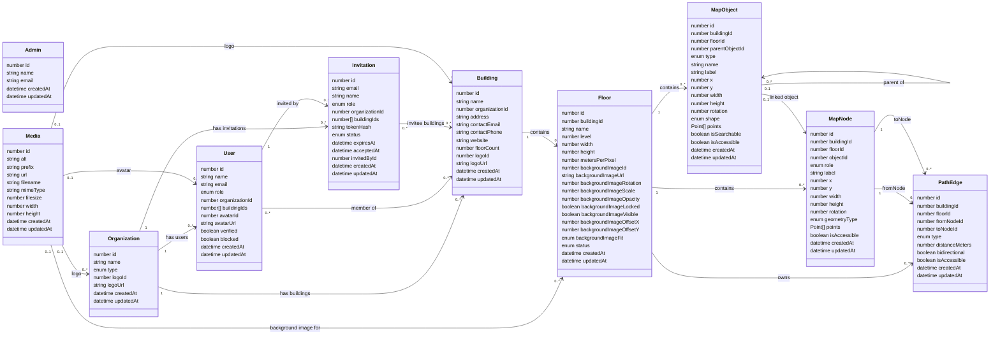

# Current Database Schema

This document reflects the application collections currently registered in
`src/collections/index.ts` and stored through Payload CMS using the configured
SQLite or MongoDB adapter.



## Registered collections

| Payload slug | Purpose |
| --- | --- |
| `admins` | Payload Admin accounts — the platform team. Separate from organization accounts and unrelated to any organization. |
| `users` | Organization accounts, application roles, organization membership, and building membership |
| `invitations` | Pending/accepted/revoked email invites for adding a teammate — see [User](#user) and [Invitation](#invitation) |
| `organizations` | Organization name and organization type |
| `buildings` | Buildings belonging to an organization — name, contact/address metadata, and a cached floor count |
| `media` | Uploaded files, including floor reference images |
| `floors` | Floor dimensions, scale, status, and background-image settings |
| `map-objects` | Rooms, walls, doors, hallways, connectors, and other visible map geometry |
| `map-nodes` | Walkable points used to construct the navigation graph |
| `path-edges` | Weighted connections between navigation nodes |

`SearchableItems` is not a registered collection. Searchability is currently
stored directly on each map object using `isSearchable`, and searchable map
objects are used as destinations in the viewer.

## Field values

### Organization

`type` can be:

```text
hospital | university | mall | office | airport | library | other
```

One organization can have many `users` and many `buildings`. `logo` is an
optional relationship to `media`, editable by the organization's owner or
manager from `/dashboard/organization`. `logoUrl` is a denormalized copy of
`logo`'s resolved `media.url`, kept in sync by a `beforeValidate` hook
(`createSyncMediaUrlHook` in `src/collections/hooks/syncMediaUrl.ts`)
whenever `logo` changes — reads use `logoUrl` directly instead of populating
the `logo` relation, which avoids an extra populate hop into `media` and the
populate-restriction pitfall documented in `docs/technical/MEDIA_STORAGE.md`.
When `logo` is replaced or cleared, an `afterChange` hook
(`createCleanupReplacedMediaHook` in
`src/collections/hooks/cleanupReplacedMedia.ts`) deletes the previous
`media` doc (and, via the storage plugin's own `afterDelete` hook, the real
file in R2) — the same cleanup hook is also applied to `Building.logo`,
`User.avatar`, and `Floor.backgroundImage`, so no upload flow leaks a
replaced file.

### Building

`organization` is a required relationship — every building belongs to
exactly one organization, and an organization can have many buildings.

`floorCount` is a denormalized cache of how many floors belong to the
building, kept in sync by an `afterChange`/`afterDelete` hook on `Floors`
(`src/collections/map/Floors.ts`) — it exists so dashboards can read a
building summary without a separate floor-count query. It is not an
authoritative source; it is always derived from `floors.building`.

`address`, `contactEmail`, `contactPhone`, and `website` are optional
metadata fields for the building's location and contact info. `logo` is an
optional relationship to `media`; `logoUrl` denormalizes its resolved
`media.url` the same way `Organization.logoUrl` does (see that section).
All of these fields (name included) are editable only by the organization's
owner or manager, from `/dashboard/buildings/[buildingId]` — a member
assigned to the building can read but not edit this record (see
`docs/security/RBAC.md`).

### User

`role` can be:

```text
owner | manager | member
```

- **owner** — the organization's creator (assigned automatically on signup).
  There is one owner per organization. An owner implicitly has access to
  every building in their organization — no explicit `buildings` membership
  is needed or stored for them.
- **manager** — has the same organization-wide building and map-management
  permissions as an owner. Managers do not need explicit building assignments.
- **member** — full create/update/delete access to map content (floors, map
  objects, map nodes, path edges) in the buildings listed in their
  `buildings` field — being assigned to a building is what grants working
  access to it. A member's access to the *building's own record* (name,
  address, contact info, logo) is read-only; only an owner or manager can
  edit that.

Payload adds authentication fields to the user collection, including email,
password hashes, verification data, password-reset data, login-attempt data,
and sessions. Sensitive authentication fields are managed by Payload and are
not ordinary editor fields.

The `organization` relationship is required — every user belongs to exactly
one organization (one email = one user = one organization). One organization
can have many users.

The `buildings` relationship (`hasMany`) stores explicit building membership
for `member` accounts. Owners and managers implicitly access every building in
their organization, so their authorization does not depend on this field.

`avatar` is an optional relationship to `media`, editable by the user
themself (or an owner/manager) from `/dashboard/profile`. `avatarUrl`
denormalizes its resolved `media.url` the same way `Organization.logoUrl`
does (see that section).

`blocked` (default `false`) is owner/manager-initiated: an owner or manager
can block another user in their organization from `/dashboard/users/[id]`, which
prevents that account from signing in (enforced by a `beforeLogin` hook,
`blockLoginHook` in `src/collections/hooks/blockLogin.ts`, that throws when
`user.blocked` is true). This is distinct from Payload's own `loginAttempts`/
`lockUntil` fields, which handle automatic lockout after repeated failed
password attempts, not an intentional block.

Field-level access locks `role`, `buildings`, and `blocked` to platform admins
and to an owner/manager acting on a *different* user in their organization
(`canManageOrgUserFields` in `src/collections/access/index.ts`) — a user can
never set these fields on their own record, which is what prevents
self-escalation (or self-blocking) from the `/dashboard/users` management
page. `organization` stays platform-admin-only regardless of who is acting,
since reassigning a user's org isn't a supported operation.

#### Why User → Organization is many-to-one, not many-to-many

`users.email` is unique — Payload's `auth` config enforces this automatically,
since email is the login identifier. Each `users` document also has exactly
one `organization` field (a single relationship, not `hasMany`), so the
structural cardinality is Organization (1) —< User (many): one organization
has many users, but each user row points to exactly one organization.

The natural real-world relationship that *would* be many-to-many is between a
**person** and organizations — the same person could plausibly need access to
two different organizations. But this schema doesn't model "person" as its
own entity; it models `users` as one authentication account per email, and
each account is scoped to a single organization by design. A person who needs
access to two organizations cannot reuse one email across two `users`
documents (the unique constraint forbids it) — they need two separate
accounts with two different email addresses, each scoped to its own
organization. Because of that, "email" — not "person" — is the right unit to
reason about here: one email always resolves to exactly one organization
membership, so the relationship correctly collapses to many-to-one instead of
many-to-many.

### Invitation

`role` can be:

```text
manager | member
```

Never `owner` — an invitation can't grant ownership, the same ceiling
`access.userCreate` already enforces for direct user creation.

`status` can be:

```text
pending | accepted | revoked
```

There is no `expired` status; expiry is a plain comparison against
`expiresAt` wherever `status === "pending"` is checked, not a stored state.

An owner/manager invites a teammate by email instead of creating their
account directly (see `docs/technical/USER_INVITATIONS.md` for the full
flow). `email`, `name`, `role`, `organization`, and — for a `member`
invite — `buildings` describe the account that will be created on
acceptance. `tokenHash` is the sha256 hash of a random token; the raw token
is only ever sent in the invite email, never stored. `invitedBy` is a
required relationship to the inviting `users` record.

No `users` document exists for an invitation until it is accepted — an
invite that's never accepted or is revoked leaves no trace in `users`, only
a non-`pending` `Invitation` row. Resending an invite creates a new
`Invitation` document (fresh token and `expiresAt`) and sets the previous
one's `status` to `revoked`, rather than mutating the original in place, so
every invite attempt stays in the audit trail.

`update`/`delete` access is `noOne` — an invitation is only ever mutated
through the invite/resend/revoke/accept actions in
`src/features/invitations/`, never edited directly.

### Admin

The separate `admins` authentication collection is the only collection allowed
to sign in to Payload Admin. Admin accounts represent the platform team, are
not organization users, are not linked to any organization, and do not use
the application user role field. The `owner`/`manager`/`member` roles on a
`users` record are application-level roles only and do not grant access to
Payload Admin.

### Floor

`status` can be:

```text
draft | published
```

`backgroundImageFit` can be:

```text
fill | cover | contain
```

The floor stores its coordinate-space size in `width` and `height`.
`metersPerPixel` converts map-coordinate distance into real-world metres.

A floor can reference an uploaded `media` record through `backgroundImage`.
`backgroundImageUrl` remains available as a text-based image source. Rotation,
scale, opacity, visibility, lock state, offsets, and fit are stored alongside
the floor.

`building` is a required relationship to the `buildings` collection. Every
floor belongs to exactly one building; a building can have many floors.
`map-objects`, `map-nodes`, and `path-edges` each carry their own `building`
relationship too (rather than only deriving it through their `floor`), so
building-scoped access control can filter each of those collections directly.

### Map object

`type` can be:

```text
room | wall | door | hallway | stairs | elevator | escalator | washroom |
exit | poi | aisle | shelf | section
```

`shape` can be:

```text
rectangle | ellipse | polygon
```

Position and geometry are stored using `x`, `y`, `width`, `height`, `rotation`,
and optional `points`. Every point contains numeric `x` and `y` values. Payload
also assigns an optional internal ID to array entries.

`parentObject` is an optional self-relationship used to place one map object
inside another. `isSearchable` controls whether an object can appear as a map
destination, while `isAccessible` records its accessibility state.

### Map node

`role` can be:

```text
entrance | exit | hallway_point | stairs_entry | elevator_entry |
escalator_entry | shelf_access
```

`geometryType` can be:

```text
rectangle | polygon | line | icon
```

A node belongs to one floor and may optionally reference a map object. Its
geometry is stored through `x`, `y`, optional size and rotation fields, and an
optional points array.

### Path edge

`type` can be:

```text
walkway | stairs | elevator | escalator | ramp
```

Every edge belongs to a floor and requires both a `fromNode` and a `toNode`.
`distanceMeters` is the weight used by shortest-path navigation.
`bidirectional` controls whether the graph can traverse the edge in both
directions, and `isAccessible` controls whether it is allowed in accessible-only
routes.

Cross-floor stairs, elevators, escalators, and ramps still use path-edge
records. The edge is stored under its origin floor and can point to a node on a
different floor.

## Access control

`src/collections/access/index.ts` defines the reusable access functions:

- `isPlatformAdmin` — true only for the `admins` auth collection (the
  platform team). Used to gate `admins` and the platform-only paths of
  `organizations`/`users`/`buildings`.
- `accessibleBuildingIds(req)` — resolves the set of building IDs a `users`
  account can access: every building in their organization for `owner` and
  `manager`, or their explicit `buildings` relationship for `member`. Platform admins
  bypass this entirely.
- `buildingRead` / `buildingCreate` / `buildingUpdateDelete` — read/write
  access for the `buildings` collection itself. Owners and managers can manage
  buildings only in their organization; members only read assigned buildings
  (a member never gets write access to a building's own record).
- `buildingContentRead` / `buildingContentCreate` / `buildingContentUpdateDelete` — read/write access for
  `floors`, `map-objects`, `map-nodes`, and `path-edges`, scoped by their own
  `building` field. Unlike the `building*` functions above, these include
  `member` in write access — a member gets full CRUD on the content of any
  building in their `accessibleBuildingIds`.
- `organizationUpdate` — owner/manager can update only their own
  organization's record; create/delete stay platform-admin-only.
- `userRead` / `userCreate` / `userUpdate` / `userDelete` — an owner/manager
  can read and manage every non-owner user in their own organization
  (`userCreate` also blocks assigning the `owner` role); any user can always
  read/update their own record via the `isSelf`-style branch in
  `userRead`/`userUpdate`, but never delete themself; the org's owner cannot
  be updated or deleted by a manager.
- `canManageOrgUserFields` — the field-level check backing `users.role`,
  `users.buildings`, and `users.blocked`: platform admin, or an owner/manager
  acting on someone else. Never true when the target is the requester's own
  record.
- `invitationRead` / `invitationCreate` — same ceiling as `userRead`'s
  org-scoped branch and `userCreate` respectively: owner/manager, own
  organization only, and a created invitation's `role` can never be `owner`.
  `update`/`delete` are `noOne` for `invitations` (see [Invitation](#invitation)).
- `isOwnerOrManager(role)` (`src/collections/constants/roles.ts`) — the
  shared `role === "owner" || role === "manager"` check reused by every
  access function above plus the `/dashboard/users*` pages and the
  invitation actions; not itself an `Access` function, just the predicate
  they're all built from.

## How the records rebuild a map

```text
Building groups an organization's floors
                 |
                 v
Floor dimensions and image settings
                 |
                 v
      Map objects draw the visible floor
                 |
                 v
       Map nodes create graph vertices
                 |
                 v
   Path edges connect and weight the vertices
                 |
                 v
 Searchable objects become route destinations
```

The database stores structured values rather than a screenshot. Loading the
building, floor, objects, nodes, and edges gives the editor and viewer enough
information to redraw the map and rebuild its navigation graph.

## Payload-managed collections

Payload also creates internal collections and tables for features such as
key-value storage, locked documents, preferences, and migrations. They are
framework infrastructure, not part of Wayfinder's application-level map
schema, so they are not included in the diagram above.
