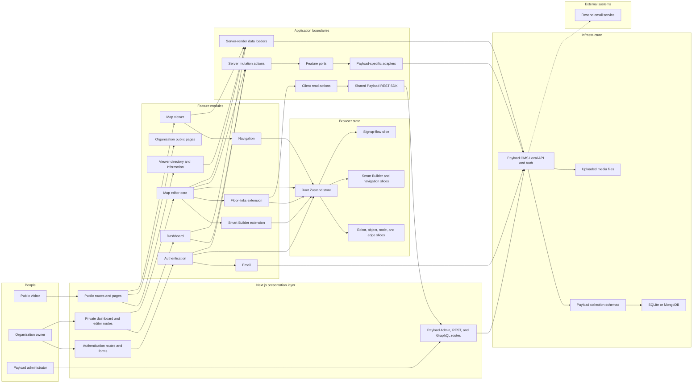
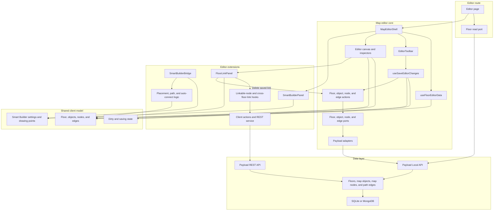
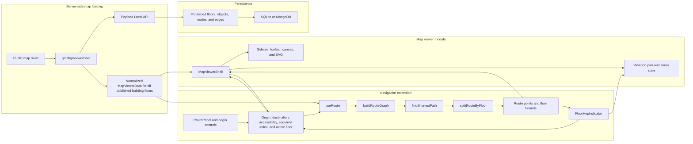
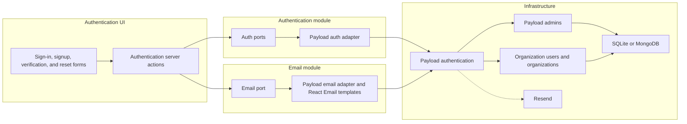

# Wayfinder Application Architecture

This document shows how the main parts of Wayfinder connect and communicate.
The diagrams describe the current codebase, including its feature modules,
ports and Payload adapters, editor extensions, shared state, navigation pipeline,
database, and external email provider.

## Architecture style

Wayfinder is a **modular monolith** built with Next.js. It runs as one
application, but the code is divided into feature modules with clear
responsibilities.

The main architectural ideas are:

- thin Next.js routes select a feature and render its main component;
- feature modules own their UI, hooks, types, stores, and business logic;
- client-triggered writes pass through server actions, ports, and Payload
  adapters;
- server-rendered reads usually call server-side loaders directly;
- Zustand provides temporary browser state for the editor and navigation;
- Payload CMS provides authentication, validation, collection APIs, and data
  access;
- an environment-selected SQLite or MongoDB adapter stores the application records;
- navigation derives a route from map-viewer data instead of loading a second
  copy of the map;
- Smart Builder and floor links extend the core editor through shared contracts
  and store actions.

## 1. Whole-application block diagram



### How to read this diagram

The upper half contains user-facing routes and feature modules. The lower half
contains communication boundaries and infrastructure.

A feature does not normally write directly to the database. It asks a port to perform
an operation. A Payload adapter implements that port and talks to Payload CMS.
Payload validates the collection data and then writes it through the selected
database adapter. `DATABASE_ENGINE=sql` selects SQLite; `DATABASE_ENGINE=mongo`
selects MongoDB.

## 2. Ports-and-adapters communication

Ports and adapters keep business-facing function names separate from the
database technology.

```mermaid
flowchart LR
    subgraph browser ["Browser"]
        component["Feature component"]
        hook["Feature hook"]
    end

    subgraph boundary ["Feature boundary"]
        mutationAction["Server mutation action"]
        clientReadAction["Client read action"]
        featurePort["Port"]
        clientService["Client service"]
    end

    subgraph adapters ["Technology adapters"]
        payloadAdapter["Payload Local API adapter"]
        restSdk["Payload REST SDK"]
    end

    subgraph payload ["Payload CMS"]
        localApi["Local API"]
        restApi["REST API with access rules"]
        collectionValidation["Collection validation and access"]
    end

    subgraph storage ["Storage"]
        database["SQLite or MongoDB"]
    end

    component -->|"Create, update, or delete"| mutationAction
    mutationAction --> featurePort
    featurePort --> payloadAdapter
    payloadAdapter --> localApi

    hook -->|"Client-triggered read"| clientReadAction
    clientReadAction --> clientService
    clientService --> restSdk
    restSdk --> restApi

    localApi --> collectionValidation
    restApi --> collectionValidation
    collectionValidation --> database
```



### Mutation path

Client-triggered writes use this path:

```text
Component
  -> actions/server
  -> service port
  -> Payload adapter
  -> Payload Local API
  -> collection
  -> selected database adapter
```

Examples include authentication mutations, floor creation, floor status
changes, editor saves, and deletes.

### Client-triggered read path

The floor-links extension needs data after the editor is already running. It
uses this path:

```text
Hook
  -> actions/client
  -> services/client
  -> shared Payload SDK
  -> Payload REST API
  -> collection access rules
  -> selected database adapter
```

### Server-rendered read path

Data needed to render a page on the server does not use a server action:

```text
Next.js Server Component
  -> server loader or server port
  -> Payload Local API
  -> selected database adapter
  -> normalized data
  -> feature shell
```

The floor editor uses `getFloorEditorData` through `floor.ports.ts`. The public
map viewer uses `getMapViewerData`. Both the viewer homepage and the searchable
`/venues` directory use `getPublicLandingData`, which groups
published floors by building before rendering venue-level choices.

The current dashboard loader calls the Payload Local API directly for its
server-rendered read. Dashboard mutations still use dashboard ports and a
Payload adapter.

## 3. Map editor and extension modules

The editor core owns the editable map model. Smart Builder and floor links are
extensions: they add or derive editor entities through the same store contracts
instead of creating separate map models.



### Smart Builder extension

Smart Builder watches editor state and uses pure helper logic to:

- create navigation nodes for eligible objects;
- connect nearby nodes;
- build hallway paths from clicked points;
- add the generated nodes and edges to the core editor store.

Generated entities are still ordinary editor objects, nodes, and edges. The
core `useSaveEditorChanges` hook saves them through the normal core ports and
adapters. Smart Builder therefore extends creation behavior without owning a
second persistence system.

### Floor-links extension

Floor links connect stairs, elevator, or escalator nodes on different floors.
The extension:

1. reads eligible nodes and existing links through client actions and the
   Payload REST SDK;
2. creates a cross-floor edge in the shared editor store;
3. relies on the core save hook to persist a new edge;
4. uses the core edge server action when an already-saved link is deleted.

This module owns the cross-floor linking experience, while the editor core owns
the edge data model and persistence contract.

## 4. Save path from browser to database

```mermaid
sequenceDiagram
    actor Owner
    participant Toolbar as Editor toolbar
    participant SaveHook as useSaveEditorChanges
    participant Store as Zustand editor slices
    participant Actions as Entity server actions
    participant Ports as Entity ports
    participant Adapters as Payload adapters
    participant Payload as Payload Local API
    participant DB as SQLite or MongoDB

    Owner->>Toolbar: Press Save Changes
    Toolbar->>SaveHook: saveChanges
    SaveHook->>Store: Read dirty floor and entities
    SaveHook->>Actions: Save floor if dirty
    Actions->>Ports: updateFloor
    Ports->>Adapters: updateFloorAdapter
    Adapters->>Payload: Update floors collection
    Payload->>DB: Write floor record
    SaveHook->>Actions: Create or update objects
    Actions->>Ports: Object operations
    Ports->>Adapters: Object adapters
    Adapters->>Payload: Write map objects
    Payload->>DB: Store object records
    SaveHook->>SaveHook: Replace temporary object IDs
    SaveHook->>Actions: Create or update nodes
    Actions->>Ports: Node operations
    Ports->>Adapters: Node adapters
    Adapters->>Payload: Write map nodes
    Payload->>DB: Store node records
    SaveHook->>SaveHook: Replace temporary node IDs
    SaveHook->>Actions: Create or update edges
    Actions->>Ports: Edge operations
    Ports->>Adapters: Edge adapters
    Adapters->>Payload: Write path edges
    Payload->>DB: Store edge records
    SaveHook->>Store: Replace saved data and clear dirty state
    SaveHook-->>Toolbar: Saving complete
```



Objects are saved before nodes because nodes may reference objects. Nodes are
saved before edges because edges require real `fromNode` and `toNode` database
IDs.

## 5. Public map viewer and navigation extension

Navigation is an extension of the map viewer. It consumes the normalized map
data that the viewer already loaded; it does not fetch its own floor, node, or
edge records.



### Navigation calculation flow

```text
MapViewerData plus route intent
            -> build graph from all nodes and edges
            -> run Dijkstra shortest-path search
            -> split the path into floor segments
            -> create route points for the active floor
            -> pass route geometry back to MapViewerShell
            -> draw the route in MapViewerSvg
```

The dependency direction is important:

```text
Navigation depends on normalized map-viewer data.
Map-viewer rendering does not import navigation business logic.
MapViewerShell acts as the integration bridge between the two modules.
```

The navigation Zustand slice stores user intent only. The graph and computed
route are derived with memoized pure functions, which prevents stale route data
from being stored separately. The active floor also lives in this slice rather
than as `MapViewerShell` component state, so every entry point that changes it
(the header floor select, the sidebar floor list, a canvas connector jump, a
route panel segment row, and `FloorHopIndicator`) reads and writes the same
state instead of drifting out of sync with the active route segment.

## 6. Authentication and email flow



Payload manages sessions and authentication for two separate account types.
The `admins` collection authenticates Payload Admin, while the `users`
collection handles organization signup, verification, and password recovery.
React Email templates create the HTML, while the configured Payload email
adapter sends messages through Resend.

## 7. Module ownership summary

| Module | Owns | Communicates through |
| --- | --- | --- |
| Authentication | Accounts, sessions, signup flow, verification, and password recovery | Server actions, auth ports, Payload auth adapter |
| Dashboard | Organization summary, floors, publication status, and floor creation | Server loader plus mutation ports and adapters |
| Map editor core | Editable floor, objects, nodes, edges, selection, canvas, and persistence | Zustand slices, server actions, entity ports, Payload adapters |
| Smart Builder | Automated node creation, auto-connect behavior, and hallway path building | Core editor store actions and pure helper functions |
| Floor links | Cross-floor connector discovery and linking UI | Client actions, Payload REST SDK, core edge store and edge mutation action |
| Viewer | Searchable published venue directory, public About page, grouped building floors, and popular-map shortcuts | Server-only loader and Payload Local API |
| Organization | Public organization landing and About pages | Static server components |
| Map viewer | Normalized published building data, floor switching, viewport, and SVG rendering | Server-only loader, local component state, props |
| Navigation | Route intent, graph creation, shortest path, floor segments, and route overlay | Navigation store slice, pure functions, `MapViewerShell` bridge |
| Email | Welcome and account-related email rendering and delivery | Email port, Payload email adapter, Resend |

## 8. Important dependency rules

The intended dependency direction is:

```text
Route -> Feature component -> Action or server loader -> Port -> Adapter
      -> Payload -> Collection -> selected database adapter
```

For browser-only feature collaboration:

```text
Component -> Feature hook or store action -> Shared typed state
```

Important rules:

1. UI components should not call Payload or the configured database directly.
2. Client-triggered mutations go through server actions.
3. Client-triggered reads go through client actions and the REST SDK.
4. Server-rendered reads use server-only loaders directly.
5. Ports describe feature operations; adapters contain Payload-specific code.
6. Extensions use core contracts instead of creating duplicate data models.
7. Navigation derives its graph from viewer data instead of fetching a parallel
   copy.
8. Payload collections are the persistence schema; whether SQLite or MongoDB
   stores them is an implementation detail selected through the environment.

## 9. Current implementation notes

This document diagrams the architecture that exists today, including a few
places that do not fully follow the preferred convention:

- the dashboard server-rendered loader uses Payload directly instead of a read
  port;
- the viewer-directory and map-viewer loaders are server-only functions that use
  the Payload Local API directly;
- the `/editor` floor-list page currently queries Payload directly from its
  route;
- map-loading queries currently use fixed limits rather than retrieving every
  pagination page.

These notes matter because a diagram should show the real application, not only
the desired architecture. Future refactoring can move the direct route or loader
calls behind dedicated server services without changing the feature UI.
