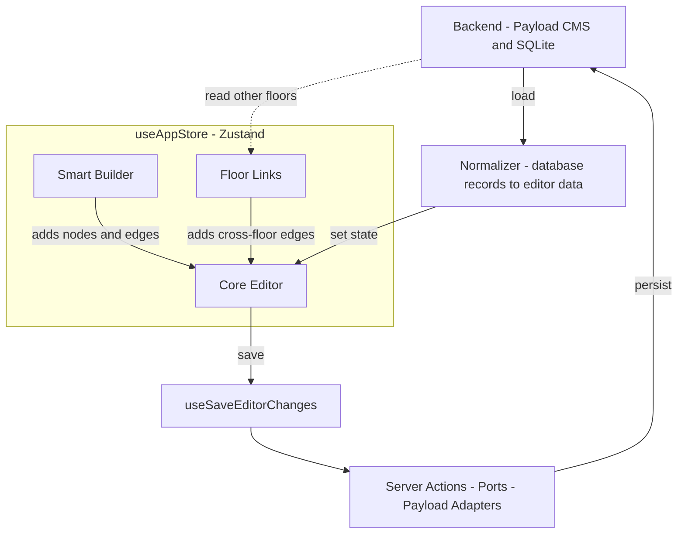

# Simple Editor Data Flow

This diagram shows how map data loads into the editor, how the editor modules
share state, and how changes are saved back to the database.

## Arrow meaning

```text
A --> B
```

This means **A sends data to, calls, or is aware of B**.

## Block diagram



## Flow in plain language

```text
1. Payload reads the saved map from SQLite.
2. The floor port and Payload adapter normalize the database records.
3. useFloorEditorData places the normalized records in useAppStore.
4. Core Editor, Smart Builder, and Floor Links work with the shared editor data.
5. Changes remain in browser memory and are marked dirty.
6. The user presses Save Changes.
7. useSaveEditorChanges sends changed records through server actions and ports.
8. Payload validates and stores the records in SQLite.
```

## Module awareness

```text
Smart Builder --> Core Editor
Floor Links --> Core Editor
Core Editor --> useSaveEditorChanges
useSaveEditorChanges --> Server actions and ports
Server actions and ports --> Payload adapters
Payload adapters --> Payload CMS and SQLite
```

Smart Builder and Floor Links do not own separate copies of the map. They add
nodes or edges to the Core Editor's shared state. The Core Editor save flow then
persists those changes.

The dotted Backend-to-Floor-Links arrow represents its additional read path.
Floor Links reads eligible connector nodes and saved cross-floor links through
the Payload REST API before adding a new edge to the shared editor state.
