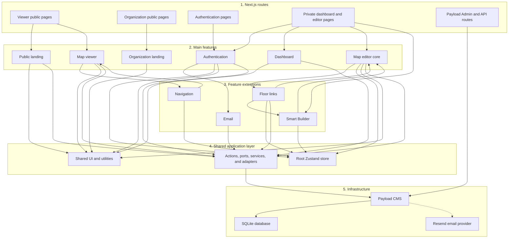
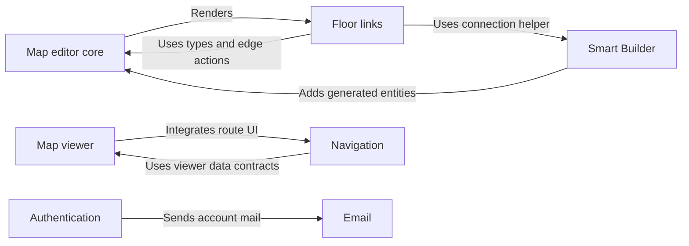
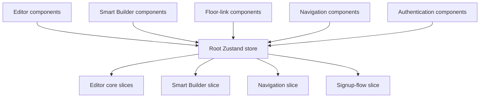

# Simple Feature Architecture

This is a simplified view of where Wayfinder's features sit and which modules
know about other modules.

For the detailed ports, adapters, database, and request flows, see
[`APPLICATION_ARCHITECTURE.md`](APPLICATION_ARCHITECTURE.md).

## How to read the arrows

```text
Module A --> Module B
```

The arrow means:

> Module A is aware of, imports, calls, renders, or otherwise uses Module B.

The module at the arrow's destination does not automatically know about the
module at the arrow's beginning.

## Simple block diagram



## Where each feature sits

```text
Next.js routes
    |
    v
Main features
    |
    +-- optional feature extensions
    |
    v
Shared state and application boundaries
    |
    v
Payload CMS
    |
    v
SQLite
```

### Public landing

The public landing feature shows available venues, published floors, and recent
destinations.

```text
Public pages --> Public landing --> Data boundary --> Payload --> SQLite
```

It does not know about the editor or navigation features.

### Organization landing

The organization landing feature explains the management workflow and owns the
public organization About experience. It links organization owners to the
existing registration and sign-in routes, but it does not own authentication,
organization data, or dashboard behavior.

```text
Organization public pages --> Organization landing --> Authentication routes
```

Viewer routes live under the `(viewers)` route group. Organization information
lives under `(organization)` and is available at `/organization` and
`/organization/about`.

### Authentication and email

Authentication owns signup, sign-in, sign-out, email verification, and password
recovery. It uses the email feature when it needs to send account-related mail.

```text
Authentication --> Email --> Payload --> Resend
Authentication --> Payload --> Users and organizations in SQLite
```

Email does not need to know about the dashboard, editor, viewer, or navigation.

### Dashboard

The dashboard displays the organization and its floors. It creates floors and
changes their published status.

```text
Private page --> Dashboard --> Data boundary --> Payload --> SQLite
```

The dashboard links the user to the editor, but it does not own editor state.

### Map editor core

The map editor core owns the editable floor, objects, nodes, edges, canvas,
selection, and save process.

```text
Editor page --> Map editor core --> Root store
Map editor core --> Data boundary --> Payload --> SQLite
```

The editor core renders the floor-links panel inside its inspectors, so the core
is currently aware of the floor-links extension.

### Smart Builder

Smart Builder extends the editor. It uses editor types and helper functions,
then adds generated nodes and edges to the same editor state.

```text
Smart Builder --> Map editor core
Smart Builder --> Root store
```

It does not save through a separate database path. The editor core's normal
save process persists its generated data.

### Floor links

Floor links connect stairs, elevators, and escalators across floors.

```text
Floor links --> Map editor core
Floor links --> Smart Builder connection helper
Floor links --> Root store
Floor links --> Data boundary
```

The editor core knows about floor links because its object and node inspectors
render `FloorLinkPanel`. Floor links know about the editor core because they use
its types, edge actions, and store data. This is a two-way module awareness in
the current implementation.

### Map viewer

The map viewer loads published floors and draws objects, nodes, edges, floor
controls, and the route overlay.

```text
Public map page --> Map viewer --> Data boundary --> Payload --> SQLite
```

### Navigation

Navigation extends the map viewer. It builds a graph, calculates the shortest
path, splits it by floor, and provides route geometry and controls.

```text
Map viewer --> Navigation
Navigation --> Map viewer types and viewport contracts
Navigation --> Root store
```

The awareness currently goes in both directions:

- `MapViewerShell` imports navigation components and hooks;
- navigation imports map-viewer types, constants, and viewport contracts.

Navigation does not fetch another copy of the map. It calculates its route from
the data already loaded by the map viewer.

## Extension relationship summary



## Shared store composition

The root Zustand store combines slices owned by several features:



The root store is the composition point. Each feature owns its slice, while
components use the combined `useAppStore` hook.

## Short summary

```text
Public landing ------> reads published venue data
Organization landing -> explains organization setup and links to auth
Authentication ------> manages accounts and uses Email
Dashboard -----------> manages floors
Map editor core -----> owns editable map data and saving
Smart Builder -------> extends map creation
Floor links ---------> extends cross-floor editing
Map viewer ----------> displays published maps
Navigation ----------> extends the viewer with route calculation
Email ---------------> sends account messages
```

The main features own the product experiences. Extensions add focused behavior
to a main feature. Shared state and data boundaries connect those features to
Payload, and Payload stores the final records in SQLite.
